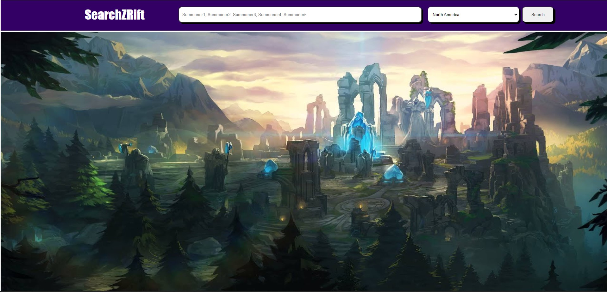
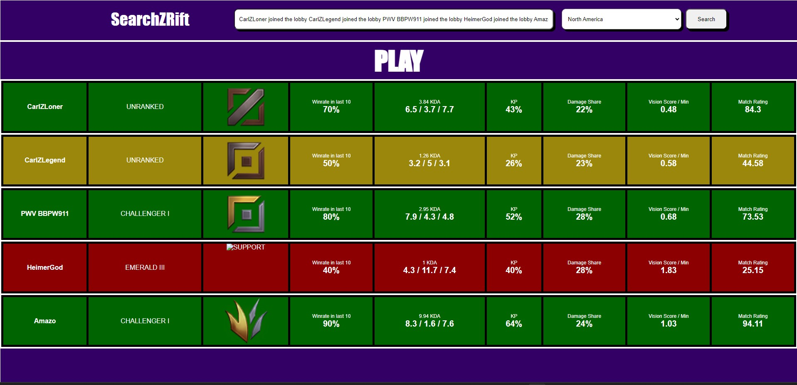
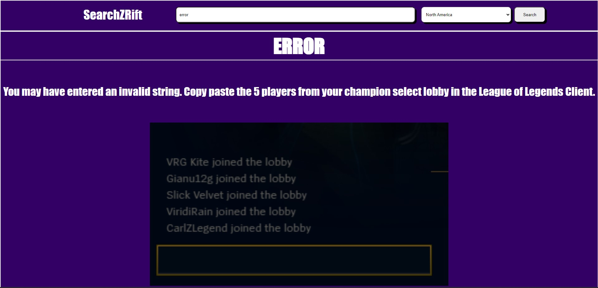

# ZLobbyExposer

ZLobbyExposer represents a fresh approach to the functionality provided by [SearchZRift](https://github.com/CarlZProj/searchzrift).\
While SearchZRift was initially developed using Django, ReactJS (CRA), and weighted averages for match analysis,\
ZLobbyExposer takes advantage of a leaner and faster stack, employing Flask, ReactJS (Vite), and utilizing the power of scikit-learn's decision trees for enhanced accuracy in player match analysis.\
This README offers comprehensive guidance on configuring, setting up, and effectively utilizing the project for League of Legends lobby player analysis.

## Table of Contents

- [Getting started](#gettingstarted)
- [Screens](#screens)
- [Strategy](#strategy)

## Getting started

First, clone the repository:

`git clone https://github.com/CarlZProj/zlobbyexposer.git`

### In one terminal

Navigate to the `/backend` directory and intsall the necessary dependcies:

`pip install -r requirements.txt`

Run the Flask server

`python main.py`

## In another terminal

Navigate to the `/frontend` directory and intsall the necessary dependcies:

`npm install`

Run the dev environemnt

`npm run dev`

## Screens

Home Screen

Lobby Screen

Error Screen

## Strategy

Data from [Kaggle League of Legends Dataset](https://www.kaggle.com/datasets/prestonrobertson7/league-of-legends-data-9292022)

Preprocess and split data by role (TOP, JUNGLE, MIDDLE, BOTTOM, SUPPORT)

Train and create an optimzed decision tree classifier optimzed through hypertuning of max_depth, min_samples_split, min_samples_leaf

Export role classifiers to predict player ratings based on historical match history
